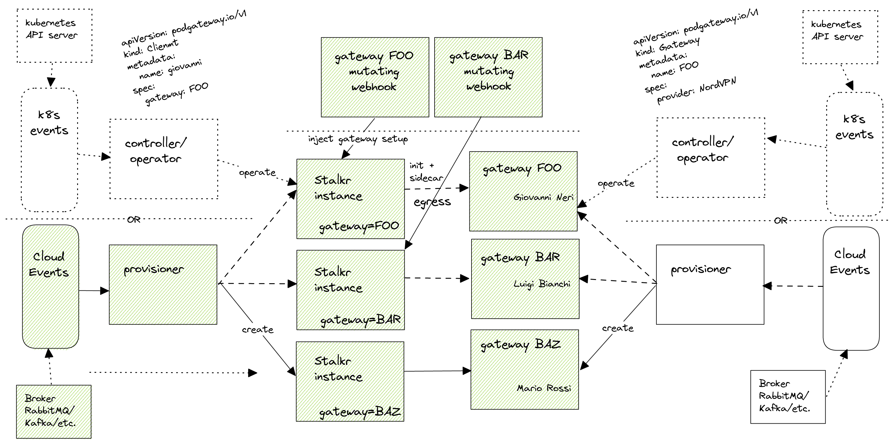

# VNEXT

This documentation provides ideas for a following of this architecture.

In particular, automation event-driven applied to the client (Crawler), can be applied to the server (pod gateway).

## Controllers and Operators

As the logics increase in complexity some component smarter than a provisioner is a good idea.

Following Kubernetes paradigm of control loops of the controllers, controllers and maybe operators can find their place in this architecture.

With this approach, Clients and Gateways can be treated as custom resources on which controllers operate.

Defining a structure of these resources Kubernetes CRD can be leveraged, ending up following the operator pattern.

Operators could be defined for:
- client
- gateway

with related CRD.

The desired state of the resources can this way be declared, for example:

```yaml
apiVersion: podgateway.io/v1
kind: Gateway
metadata:
  name: foo
  namespace: gateway-system 
spec:
  vpn:
    enabled: true
    type: openvpn
    config:
      secretRef:
        name: openvpn-conf  
        namespace: gateway-system
```

```yaml
apiVersion: podgateway.io/v1
kind: Client
metadata:
  name: foo
  namespace: crawler-system 
spec:
  gatewayRef:
    name: foo
    namespace: gateway-system 
```

and resources created either by humans or by automation components, even connecting them to events, like Cloud Events or Kubernetes Events.



